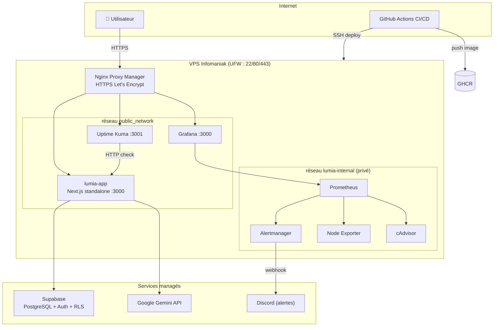

# Lumia : Assistant vocal de gestion de calendrier

Lumia est un assistant vocal intelligent : tu lui parles, il organise ton
calendrier. Reconnaissance vocale dans le navigateur, compréhension du
langage naturel via **Google Gemini**, données et authentification sur
**Supabase** (PostgreSQL + RLS).

**Projet MyDigitalStartup, module DevOps-Docker (Sergent.dev School).**

| Ressource | URL |
|---|---|
| App (prod) | [lumia.issa.madayev.mds-nantes.fr](https://lumia.issa.madayev.mds-nantes.fr) |
| Grafana | [grafana.lumia.issa.madayev.mds-nantes.fr](https://grafana.lumia.issa.madayev.mds-nantes.fr) |
| Statut (Uptime Kuma) | [status.lumia.issa.madayev.mds-nantes.fr](https://status.lumia.issa.madayev.mds-nantes.fr) |
| Images Docker (GHCR) | [ghcr.io/issa9595/vocal-assistant](https://github.com/issa9595/vocal-assistant/pkgs/container/vocal-assistant) |
| Pipeline CI/CD | [GitHub Actions](https://github.com/issa9595/vocal-assistant/actions) |

---

## 🏗 Architecture



Points clés : **aucune base de données sur le VPS** (Supabase managé,
voir [ADR 002](docs/adr/002-supabase-manage-plutot-que-db-auto-hebergee.md)),
**aucun port applicatif publié** (tout passe par NPM), monitoring sur un
**réseau interne** inaccessible depuis Internet.

---

## 🚀 Lancer en local

Prérequis : Node.js ≥ 24, Docker Desktop, un projet [Supabase](https://supabase.com)
(gratuit) et une clé [Gemini](https://aistudio.google.com/apikey).

```bash
# 1. Cloner et installer
git clone https://github.com/issa9595/vocal-assistant.git
cd vocal-assistant
npm install

# 2. Configurer l'environnement
cp .env.example .env
# → renseigner GEMINI_API_KEY, NEXT_PUBLIC_SUPABASE_URL, NEXT_PUBLIC_SUPABASE_ANON_KEY

# 3a. Mode développement (hot reload)
npm run dev              # http://localhost:3000

# 3b. OU mode Docker (identique à la prod)
docker compose up -d --build
curl http://localhost:3000/api/health   # {"status":"ok",...}
```

Le schéma de base est dans `supabase/schema.sql` et les policies RLS dans
`supabase/migrations/` (à exécuter dans le SQL Editor de ton projet Supabase).

Tester la stack de monitoring en local :

```bash
docker compose --profile monitoring up -d
# Grafana → http://localhost:3001 (admin / GRAFANA_ADMIN_PASSWORD du .env)
```

---

## 🔁 CI/CD

Chaque push sur `main` déclenche le pipeline GitHub Actions :

```
push main ──► 🧹 Lint (ESLint + tsc) ──► 🧪 Tests (Vitest + coverage)
                     └────────────┬────────────┘
                                  ▼
                    🏗️ Build image ──► push GHCR (sha + latest + semver)
                                  ▼
                    🛡️ Scan Trivy (FAIL si CRITICAL/HIGH)
                                  ▼
                    🚀 Deploy VPS (environment: production)
                                  ▼
                    ✅ Smoke test https://<domaine>/api/health
```

- Les PR exécutent lint + tests uniquement (pas de build ni deploy).
- Un tag `v1.2.3` produit les tags d'image `1.2.3`, `1.2`, `sha-…`, `latest`.
- Le job `deploy` utilise l'environment GitHub `production` (protection /
  review manuel configurable dans Settings → Environments).

### Secrets & variables GitHub à configurer

| Type | Nom | Description |
|---|---|---|
| Secret | `SSH_HOST` | IP du VPS |
| Secret | `SSH_PORT` | Port SSH (22 par défaut) |
| Secret | `SSH_USER` | Utilisateur de déploiement (non-root) |
| Secret | `SSH_PRIVATE_KEY` | Clé privée dédiée à la CI |
| Variable | `LUMIA_DOMAIN` | Domaine de prod (`lumia.issa.madayev.mds-nantes.fr`) |
| Variable | `NEXT_PUBLIC_SUPABASE_URL` | URL du projet Supabase |
| Variable | `NEXT_PUBLIC_SUPABASE_ANON_KEY` | Clé anon (publique, protégée par RLS) |

---

## 📦 Déployer en production

Procédure complète (première installation + hardening) :
**[docs/deployment/vps-security.md](docs/deployment/vps-security.md)**

En résumé, une fois le VPS provisionné :

```bash
# Sur le VPS, première installation uniquement
git clone https://github.com/issa9595/vocal-assistant.git ~/projects/lumia
cd ~/projects/lumia
cp .env.example .env && nano .env                 # secrets prod
echo "<webhook discord>" > monitoring/alertmanager/discord_webhook
docker compose -f docker-compose.prod.yml up -d
```

Puis créer les proxy hosts HTTPS dans Nginx Proxy Manager (documenté §4 du
guide sécurité). Ensuite, **chaque push sur `main` déploie automatiquement**.

Audit du hardening à tout moment :

```bash
bash scripts/check-vps-security.sh
```

---

## 📊 Observabilité

| Brique | Rôle |
|---|---|
| Prometheus | Métriques (rétention 15 j), évaluation des alertes |
| Node Exporter | CPU / RAM / disque / réseau du VPS |
| cAdvisor | Métriques par conteneur (mémoire, restarts…) |
| Alertmanager | Routage des alertes → Discord (critical vs warning) |
| Grafana | Dashboard « Lumia / Vue d'ensemble » provisionné automatiquement |
| Uptime Kuma | Check HTTP externe de `/api/health` + page de statut |

**5 alertes actionnables** (voir `monitoring/prometheus/alerts.yml`) :
`LumiaAppDown`, `MonitoringTargetDown`, `DiskSpaceLow`, `HighMemoryUsage`,
`ContainerRestarting`, chacune liée à un runbook :

- [Service down](docs/runbooks/service-down.md)
- [Disque plein](docs/runbooks/disk-full.md)
- [Rotation des secrets](docs/runbooks/rotate-secrets.md)

Dashboard complémentaire recommandé : importer **Node Exporter Full**
(ID `1860`) depuis Grafana → Dashboards → Import.

---

## 🤝 Contribuer

```bash
npm run lint            # ESLint (config Next.js), bloquant en CI
npx tsc --noEmit        # vérification TypeScript, bloquante en CI
npm test                # Vitest en mode watch
npm run test:coverage   # tests + rapport de couverture (lcov + terminal)
```

Conventions : branches `feat/…`, `fix/…`, PR vers `main` obligatoire
(lint + tests exécutés sur chaque PR), messages de commit à l'impératif.
Le fichier `.env` ne doit **jamais** être commité.

---

## ⚙️ Variables d'environnement

| Variable | Portée | Secret | Description |
|---|---|---|---|
| `GEMINI_API_KEY` | Runtime (serveur) | ✅ | Clé API Google Gemini |
| `NEXT_PUBLIC_SUPABASE_URL` | Build (client) | ❌ | URL du projet Supabase |
| `NEXT_PUBLIC_SUPABASE_ANON_KEY` | Build (client) | ❌* | Clé anon Supabase (*publique par design, sécurité via RLS) |
| `LUMIA_DOMAIN` | Prod (compose) | ❌ | Domaine principal |
| `GRAFANA_ADMIN_USER` / `GRAFANA_ADMIN_PASSWORD` | Prod (compose) | ✅ | Admin Grafana |
| Webhook Discord | Fichier `monitoring/alertmanager/discord_webhook` (VPS) | ✅ | Alertes Alertmanager |

---

## 📚 Documentation

- **ADR** : [001 Compose vs K3s](docs/adr/001-docker-compose-plutot-que-k3s.md) ·
  [002 Supabase managé](docs/adr/002-supabase-manage-plutot-que-db-auto-hebergee.md) ·
  [003 NPM mutualisé](docs/adr/003-nginx-proxy-manager-plutot-que-traefik.md)
- **Runbooks** : [service down](docs/runbooks/service-down.md) ·
  [disque plein](docs/runbooks/disk-full.md) ·
  [rotation secrets](docs/runbooks/rotate-secrets.md)
- **Sécurité VPS & NPM** : [docs/deployment/vps-security.md](docs/deployment/vps-security.md)


Proof of deployment 2